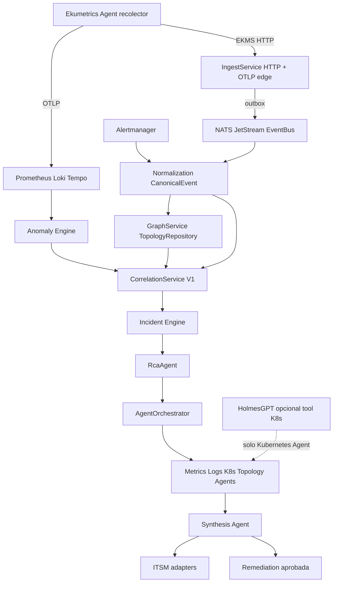

# Plan maestro de implementación AIOps — Ekumetrics

**Estado:** plan de diseño consolidado. **No es implementación.**  
**Fecha:** 2026-09-04  
**Espacio de trabajo:** `ekumetrics/` (`ekumetrics-agent/` + `ekumetrics-platform/`)

**Fuentes leídas completas (todas presentes):**

| Auditoría | Path |
|---|---|
| Arquitectura actual | `docs/aiops/current-architecture.md` |
| Gap analysis | `docs/aiops/gap-analysis.md` |
| Evolución del recolector | `docs/aiops/agent-evolution.md` |
| Diseño EventBus / NATS | `docs/aiops/event-bus-design.md` |
| Modelo de dominio | `docs/aiops/domain-model.md` |

Ninguna fuente falta. Este documento **no inventa** componentes ausentes de esas auditorías; lo que es propuesta de diseño se marca como tal.

**Nomenclatura (invariante en todo el plan)**

| Término | Significado | Dónde vive |
|---|---|---|
| **Ekumetrics Agent** | Recolector en infra del cliente (telemetría, discovery, SNMP, LLDP) | `ekumetrics-agent/` |
| **AIOps Agent** | Investigador lógico *dentro* de la plataforma (`RcaAgent`, `MetricsAgent`, `LogsAgent`, `KubernetesAgent`, `TopologyAgent`, `SynthesisAgent`) | `platform-api` / portal |
| **HolmesGPT / Holmes** | Motor/backend *posible* del Kubernetes Agent (tool layer). **No** es el orquestador ni el motor de correlación | perfil `ai`, `HOLMES_URL` |
| **EventBus** | Puerto de mensajería de la plataforma. El dominio no importa `nats` | `platform-api/src/messaging/` (propuesto) |
| Prisma `Agent` | Registro del **recolector**, nunca un AIOps Agent | `schema.prisma` |

No duplicar: `GraphNode` / `GraphEdge`, tenancy (`Tenant` / `Site` / `actingTenant` / `X-Eku-Tenant`), ni un segundo recolector.

---

## Índice

1. [Current architecture](#1-current-architecture)
2. [Reusable components](#2-reusable-components)
3. [Gaps](#3-gaps)
4. [Target architecture](#4-target-architecture)
5. [Proposed domain model](#5-proposed-domain-model)
6. [Proposed DB migrations](#6-proposed-db-migrations)
7. [NATS subjects](#7-nats-subjects)
8. [Agent changes](#8-agent-changes)
9. [Backend changes](#9-backend-changes)
10. [Frontend changes](#10-frontend-changes)
11. [Security impact](#11-security-impact)
12. [Kubernetes impact](#12-kubernetes-impact)
13. [Implementation EPICs](#13-implementation-epics)
14. [Dependencies between EPICs](#14-dependencies-between-epics)
15. [Risks](#15-risks)
16. [Acceptance criteria](#16-acceptance-criteria)
17. [STOP / aprobación](#17-stop--aprobación)

---

## Estado actual vs objetivo

Hoy el recolector envía OTLP (métricas/logs/trazas) al Collector y lotes EKMS por HTTP a `POST /v1/ekms/events` (`IngestService` → `AgentEvent`, `Asset`, `GraphService.upsertNeighbor`). La correlación es un MVP síncrono: Alertmanager → `POST /v1/incidents/correlate` → `CorrelationService` (ventana 5 min, hops 4, `commonCover`) → `Incident`. NATS JetStream (`nats:2.14.5`) está desplegado en Compose y K8s, pero **no hay cliente ni EventBus** en `platform-api`. EkuAssistant (`/asistente`, `AiService` + `RetrievalService` + Holmes/Ollama) corre **en paralelo** al incidente; no orquesta AIOps Agents. El objetivo es el pipeline Agent → Ingestion → NATS JetStream → Normalization → Observability + CMDB/Topology → Correlation → Incident Engine → RCA → Multi-Agent Investigation → ITSM / Remediation, con el LLM como capa opcional: correlación, grafo e incidente deben funcionar si Holmes, Ollama o los providers cloud caen.

---

## 1. Current architecture

Inventario factual de `docs/aiops/current-architecture.md`. Solo lo observado en el repo.

### 1.1 Repos y stack

| Pieza | Path / versión | Rol |
|---|---|---|
| Ekumetrics Agent | `ekumetrics-agent/` · Go 1.27 · `cmd/agent` | Recolector: OTLP + envelope EKMS |
| portal-web | `ekumetrics-platform/apps/portal-web/` · Angular 22.1 | UI standalone |
| platform-api | `ekumetrics-platform/apps/platform-api/` · NestJS 11.2 | BFF + dominio |
| Prisma | `apps/platform-api/prisma/schema.prisma` · 7.10 | PostgreSQL 18 + pgvector 0.8.6 |
| Contratos | `packages/shared-contracts/openapi/platform-v0.yaml` | OpenAPI eventos / plataforma |

### 1.2 Flujo de datos real (hoy)

```text
Ekumetrics Agent
  ├─ OTLP :4317/:4318 → ingest-gateway (local) | agent-edge mTLS (prod/k8s)
  │     → OTEL Collector 0.159 → Prometheus 3.14 / Loki 3.7 / Tempo 3.0
  └─ HTTP POST /v1/ekms/events → IngestService → PostgreSQL
        ├─ AgentEvent (fingerprint SHA-256)
        ├─ Asset
        └─ GraphNode / GraphEdge (neighbor_observed, source default lldp)

Alertmanager → (manual) POST /v1/incidents/correlate
  → CorrelationService → Incident (open|acknowledged|resolved|closed)

Operador → /incidentes, /investigacion (Cytoscape)
Operador → /asistente (EkuAssistant)  ← paralelo, no pipeline de incidente

NATS JetStream ──(desplegado; sin publish/subscribe de producto)──► platform-api
```

Borde: `ingest-gateway` (Nginx 1.30, Compose local, sin mTLS) y `agent-edge` (mTLS, prod/k8s). Auth recolector: `INGEST_SHARED_KEY` + assertion de edge + DN `O=tenant,OU=site,CN=agent`.

### 1.3 Módulos Nest (`app.module.ts`)

| Módulo | Path | Superficie AIOps-relevante |
|---|---|---|
| IngestModule | `src/ingest/` | `POST /v1/ekms/events` |
| IncidentsModule | `src/aiops/` | `CorrelationService`, `GraphService`, `incidents.controller.ts` |
| AlertmanagerModule | `src/alertmanager/` | overview, silencios, canales |
| AiModule | `src/ai/` | `AiService`, `RetrievalService`, Holmes transport, RAG |
| TenantsModule | `src/tenants/` | Tenant / Site / Agent / YAML recolector |
| ObservabilityModule | `src/observability/` | métricas HTTP, retención eventos, tracing |
| AuthModule | `src/auth/` | BFF OIDC, roles `operator` \| `admin` \| `viewer` \| `kiosk` |

API AIOps actual (`aiops/incidents.controller.ts`): `GET /v1/incidents`, get, `POST /v1/incidents/correlate`, `GET /v1/graph` snapshot/example/impact.

### 1.4 Frontend (rutas)

| Ruta | Página | Qué hay de AIOps |
|---|---|---|
| `/incidentes` | `pages/incidents/` | Lista + acción correlacionar |
| `/investigacion` (`/correlacion` redirect) | `pages/investigacion/` | Grafo Cytoscape + causa/impacto |
| `/asistente` (`/holmes` redirect) | `pages/holmes/` | Chat EkuAssistant; **no** orquestador |
| `/alertas` | alertas | Alertmanager |
| `/agentes` | `HomePage` matcher | Dashboards del **recolector**, no AIOps Agents |
| `/plataforma` | `pages/plataforma/` | Health/logs/traces de plataforma |
| `/administracion/*` | tenants, sitios, umbrales, IA, descarga recolector | |

Nav: `layout/nav.ts`. Interceptor: cookie BFF + `X-Eku-Tenant` (`core/auth.interceptor.ts`).

### 1.5 Prisma relevante (hoy)

`Tenant`, `Site`, `Agent` (recolector), `Asset`, `AgentEvent`, `Incident` + `IncidentStatus` (`open` \| `acknowledged` \| `resolved` \| `closed`), `GraphNode` / `GraphEdge`, `Policy`, `User`, `AlertChannel`, `AiConversation` / `AiInquiry` / `AiSettings`, `AiKnowledgeDocument` / `AiKnowledgeChunk`, `AuditLog`.

**No existen** en código: `EventBus`, `CanonicalEvent`, `IncidentCandidate`, `AIInvestigation`, `AgentFinding`, `RootCauseCandidate`, `ExternalTicketLink`, `RemediationAction`, `AgentOrchestrator`, `RcaAgent`, `MetricsAgent`, `LogsAgent`, `AiopsAgent`.

### 1.6 Infra

Compose: `infrastructure/docker/docker-compose.yml` (postgres, nats, prom, loki, tempo, alertmanager, grafana, otel, alloy, keycloak, platform-api, ingest-gateway, portal, ollama; Holmes en profile `ai`).  
K8s: Kustomize `infrastructure/k8s/` (namespace `ekumetrics`); Kind overlay `infrastructure/kind/`. **No hay Helm.**  
NATS: `nats:2.14.5-alpine`, JetStream `store_dir: /data`, `max_memory_store: 256MB`, `max_file_store: 10GB`, `max_payload: 8MB`. Conf: `infrastructure/docker/nats/nats-server.conf` y `infrastructure/k8s/nats-server.conf`.  
Redis: **no** es cache/bus de plataforma; solo target del recolector (`type: redis`, series `redis_*`).

### 1.7 Qué hay hoy de “AIOps” (síntesis)

1. Ingesta + inventario + topología LLDP → PG.  
2. Correlación determinista Alertmanager ↔ grafo → `Incident`.  
3. UI de alertas, incidentes e investigación.  
4. EkuAssistant paralelo (retrieval + LLM/Holmes).  
5. Ausente: bus de dominio, normalización, motor de incidente, RCA como agente, orquestación multi-agente, ITSM, remediación.

---

## 2. Reusable components

De `gap-analysis.md` §2 y las auditorías hermanas. **Extender, no reescribir.**

### Ekumetrics Agent (no duplicar)

| Capacidad | Path |
|---|---|
| Envelope, buffer store-and-forward, mTLS | `ekumetrics-agent/pkg/ekms/` |
| Discovery ARP/LLDP/CDP/ENTITY | `ekumetrics-agent/pkg/modules/discovery/` |
| Señal `neighbor_observed` | `pkg/ekms/envelope/envelope.go` |
| Envío HTTP a platform | `pkg/ekms/buffer/send.go` |
| Collector OTel embebido, SNMP, traps | `pkg/modules/collector/` |
| Logs Fluent Bit | `pkg/modules/fluentbit/` |
| NetFlow v5 | `pkg/modules/netflow/` |
| SAP sensor | `pkg/modules/sap/` |
| YAML canónico | `config/agent.yaml`, `pkg/agent/config/` |

### Ingestión y tenancy

| Capacidad | Path |
|---|---|
| HTTP, auth borde, fingerprint, assets | `platform-api/src/ingest/` (`ingest.service.ts`, `ingest.controller.ts`) |
| Upsert topología desde vecinos | `IngestService` → `GraphService.upsertNeighbor` |
| Tenant / Site / Agent / Asset | `prisma/schema.prisma` |
| Módulos opcionales de tenant | `tenants/tenant-modules.ts` |
| YAML de despliegue del recolector | `tenants/agent-yaml.ts` |

### Topología / CMDB parcial

| Capacidad | Path |
|---|---|
| `GraphNode`, `GraphEdge` | `prisma/schema.prisma` |
| Persistencia, snapshot, impact, seed | `aiops/graph.service.ts` |
| Walk / sharePath / commonCover | `aiops/graph-walk.ts` (+ `graph-walk.spec.ts`) |
| Grafo ejemplo | `aiops/graph-example.ts` — aislar de prod |

### Correlación e incidentes (MVP V0)

| Capacidad | Path |
|---|---|
| Cluster sitio + ventana 5m + hops 4 | `aiops/correlation.service.ts` |
| `clusterKey` SHA-256 de fingerprints | mismo |
| Causa `commonCover`, confidence 0.25–0.91 | mismo |
| API list/get/correlate + graph | `aiops/incidents.controller.ts` |
| Modelo `Incident` | `schema.prisma` |
| Módulo Nest | `aiops/incidents.module.ts` |

### Observabilidad y alertas

| Capacidad | Path |
|---|---|
| Flujo OTLP | `ekumetrics-platform/docs/architecture.md` |
| Alertmanager overview / labels | `alertmanager/alertmanager.service.ts` |
| Canales email/slack/webhook (config cifrada) | `alertmanager/alert-channels.service.ts` |
| Métricas HTTP + heartbeat recolectores | `observability/metrics.service.ts` |
| Cliente PromQL/LogQL/TraceQL | `dashboard/telemetry.client.ts` |

### Capa LLM / retrieval (tools de AIOps Agents; no cerebro)

| Capacidad | Path |
|---|---|
| Catálogo providers | `ai/ai.catalog.ts`, `ai/ai.providers.ts` |
| Chat + Holmes transport | `ai/ai.service.ts` |
| Retrieval tipado (métricas, z-score, logs, trazas, deps, eventos, incidentes) | `ai/retrieval.service.ts` |
| Prompt / redacción | `ai/investigator-prompt.ts` |
| RAG aprobado | `ai/knowledge.service.ts` |
| Settings | Prisma `AiSettings` |
| Holmes k8s (toolsets peligrosos off) | `infrastructure/k8s/config/holmes.yaml`, `infrastructure/docker/holmes/config.yaml` |

### Portal

| Capacidad | Path |
|---|---|
| Incidents | `portal-web/.../pages/incidents/` (`/incidentes`) |
| Investigación + Cytoscape | `pages/investigacion/`, `shared/eku/cy-graph/` |
| Helpers árbol | `pages/correlacion/correlacion-tree.ts` (legacy) |
| Asistente | `pages/holmes/` (`/asistente`) |

### Infra presente, no cableada a AIOps

NATS + JetStream: `infrastructure/k8s/nats.yaml`, `nats-server.conf`, Compose. Persistencia lista; **sin productores/consumidores de producto**.

---

## 3. Gaps

Frente al pipeline objetivo. Fuente: `gap-analysis.md` §§3–6.

| Área | Hoy | Objetivo | Acción |
|---|---|---|---|
| EventBus abstracto | Ausente | Puerto + impl JetStream | **crear** |
| NATS en el path de datos | Infra up; API sin cliente `nats` | Buffer/async entre capas | **extender** infra + **crear** producers/consumers |
| Normalization | Validación contrato EKMS | Identidad canónica alert↔asset↔node↔k8s | **crear** capa |
| CanonicalEvent | No; solo `AgentEvent` crudo | Unidad de correlación | **crear** |
| Correlation V1 | On-demand; `WINDOW_MS`/`HOPS`/confidence hardcoded | Scores/política por tenant + continuo | **extender** `CorrelationService` |
| Incident Engine | CRUD correlate/list/get; enum 4 estados | Lifecycle DETECTED…CLOSED, transiciones, timeline, `IncidentContext` | **extender** modelo + **crear** engine |
| IncidentCandidate | Correlación escribe `Incident` directo | Cluster preliminar + umbral | **crear** |
| TopologyRepository | `GraphService` de facto | Puerto + relaciones `RUNS_ON`/`DEPENDS_ON` + TTL/stale | **extender** / **no duplicar** grafo |
| Anomaly Engine | `findMetricAnomalies` (z-score) solo en chat | Motor que alimente correlación | **crear** (sobre retrieval) |
| RcaAgent | `commonCover` embebido en correlate | Agente + evidencia estructurada | **extender** (extraer) |
| AgentOrchestrator + AIOps Agents | Ausentes | Selección, presupuesto, PENDING…TIMEOUT, Evidence Store | **crear** |
| Tool isolation | Retrieval monolítico del chat | Toolsets por `agentType` | **crear** |
| AIProvider por agente/tenant | `AiSettings` global del asistente | Matriz Metrics sin LLM, Synthesis con LLM, fallback offline | **extender** |
| Privacy evidencia→LLM | Retención/redact de chat | `LOCAL_ONLY` / `CLOUD_*` por tenant/incidente | **crear** / **extender** |
| ITSM | No | Tickets desde incidente | **crear** |
| Remediación | No | Allowlist + aprobación | **crear** (fase tardía) |
| Métricas AIOps | HTTP + heartbeat recolector | MTTD, hallazgos, budgets, fallos orquestación | **extender** `MetricsService` |
| UI Agents / Topology | Topology mezclada en `/investigacion`; no findings | Vista topología clara + ejecuciones por incidente | **extender** / **crear** UI |
| RBAC `aiops.*` | Roles gruesos | Permisos finos | **extender** auth |
| Tests AIOps | Solo `graph-walk.spec.ts` | Correlation, engine, orchestrator, bus | **crear** |
| Degradación sin LLM | Correlación/grafo ya sin LLM | Formalizar paths offline en investigación | **reusar** base; **crear** paths |

**No es un gap de recolector ni de segundo grafo.** El mayor hueco es orquestación, motor de incidente, correlación continua/configurable y LLM como capa opcional.

---

## 4. Target architecture

Pipeline objetivo (único camino de producto). El LLM **no** es el motor de correlación. Si Holmes, Ollama o providers cloud caen: ingesta, normalización, topología, correlación, incidente y RCA determinista siguen operativos. HolmesGPT, si se usa, es backend del **Kubernetes Agent**, no orquestador.

```text
Ekumetrics Agent (recolector)
  → Ingestion (HTTP /v1/ekms/events + OTLP)
  → NATS JetStream (EventBus; raw / dominio)
  → Normalization (CanonicalEvent + identidad)
  → Observability (Prom/Loki/Tempo)  +  CMDB/Topology (Asset + GraphNode/GraphEdge)
  → Correlation V1 (determinista, scores, continuo)
  → Incident Engine (lifecycle + IncidentContext)
  → RCA (RcaAgent explicable)
  → Multi-Agent Investigation (AgentOrchestrator → Metrics / Logs / Kubernetes / Topology → Synthesis)
  → ITSM / Remediation (aprobada, allowlist)
```



### 4.1 Reglas de frontera

| Capa | Regla |
|---|---|
| Recolector | Sigue HTTP + OTLP. **No** publica NATS en el edge (MVP). |
| OTLP | Sigue Collector → Prom/Loki/Tempo. El EventBus **no** sustituye series temporales. |
| Ingest | Tras persistir en PG (fuente de verdad + outbox) publica al bus. |
| Correlación | Determinista: fingerprints, ventana, grafo, scores. Sin llamada LLM. |
| RCA V1 | Extrae `commonCover` / walk de `graph-walk.ts`. Evidencia estructurada. Sin LLM obligatorio. |
| Orchestrator | Selección, presupuesto, timeouts, persistencia. No embebe lógica de dominio. |
| Metrics/Logs/Topology Agents | Tools desde `RetrievalService` + `TopologyRepository`. Pueden correr **sin** LLM. |
| Kubernetes Agent | Tools de cluster; Holmes es **un** backend posible. Toolsets peligrosos siguen off. |
| Synthesis | Única capa que *puede* exigir LLM; si cae, el incidente queda con findings + RCA determinista. |
| EkuAssistant | Sigue siendo chat de operador (`/asistente`). No se convierte en orquestador. |
| Remediación | Solo tras aprobación y catálogo cerrado. El bus no autoriza. |

### 4.2 Encaje de procesos

Un monolito Nest (`platform-api`) + módulo `messaging`. Workers = misma imagen con `ROLE=worker` si la investigación satura HTTP. No microservicio enorme de mensajería. No Redis Streams / Kafka interno. No segundo recolector.

---

## 5. Proposed domain model

Resumen de `docs/aiops/domain-model.md`. Principios: `tenantId` en todos los modelos AIOps; extender `Incident` / `GraphNode` / `GraphEdge`; evidence-first; Prisma `Agent` = recolector (`collectorId`).

### 5.1 Mapeo Prisma actual → dominio

| Concepto dominio | Tabla Prisma | Estrategia |
|---|---|---|
| Entity | `GraphNode` (`nodeKey` ≈ `entityKey`) | **Extender**. No crear `Entity`. |
| Relationship | `GraphEdge` (hoy `relation = CONNECTS_TO`) | **Extender** catálogo: `RUNS_ON`, `DEPENDS_ON`, … |
| Incident | `Incident` | **Extender** lifecycle + `context`. No `IncidentV2`. |
| Inventario | `Asset` | Complementario; enlace `assetId` ↔ Entity. |
| Evento crudo recolector | `AgentEvent` | Fuente de CanonicalEvent. No fusionar. |
| Recolector | `Agent` | Solo Ekumetrics Agent. |
| Chat | `AiConversation` / `AiInquiry` | Fuera del pipeline de incidente. ≠ `AIInvestigation`. |
| Auditoría | `AuditLog` | Complementario; acciones `aiops.*`. |

### 5.2 Modelos nuevos vs extendidos

| Modelo | Persistencia | Rol |
|---|---|---|
| **CanonicalEvent** | **Tabla nueva** | Evento normalizado (alerta, señal, change). Estados `RAW` → `NORMALIZED` → `CORRELATED` → `SUPERSEDED` \| `EXPIRED`. Unique `(tenantId, fingerprint)`. |
| **Entity** | = `GraphNode` | Nodo CMDB/topología. Extender `attributes`, `assetId`, status stale. |
| **Relationship** | = `GraphEdge` | Arista tipada. Extender `weight`, `attributes`. |
| **IncidentCandidate** | **Tabla nueva** | Cluster preliminar (`clusterKey` = mismo hash que `CorrelationService.persist`). `OPEN` → `PROMOTED` \| `DISCARDED` \| … |
| **Incident** | **Mismo modelo** | Contenedor operativo. `status` legacy `open`…`closed` + `lifecycleStatus` AIOps (`DETECTED`…`CLOSED`). `members` / `causeKey` se conservan. |
| **RootCauseCandidate** | **Tabla nueva** | Hipótesis versionada. `causeKey`/`causeName`/`confidence` del Incident = caché de la aceptada o RCA determinista inicial. Un `ACCEPTED` por incidente. |
| **AgentFinding** | **Tabla nueva** | Resultado de un **AIOps Agent** (`agentType`: Rca, Metrics, Logs, Kubernetes, Topology, Synthesis). Estados `PENDING`…`TIMEOUT`. ≠ `AiInquiry`. |
| **AIInvestigation** | **Tabla nueva** | Corrida del `AgentOrchestrator`. Presupuesto + síntesis. |
| **ExternalTicketLink** | **Tabla nueva** | ITSM (ServiceNow/Jira/webhook). |
| **RemediationAction** | **Tabla nueva** | Acción allowlisted; ejecución solo `APPROVED`. |

Flujo de dominio:

```text
AgentEvent / Alertmanager / anomalías
  → CanonicalEvent → IncidentCandidate → Incident
       → AIInvestigation → AgentFinding(s)
       → RootCauseCandidate
       → ExternalTicketLink | RemediationAction
```

### 5.3 Estados de Incident (conflicto conocido)

Prisma hoy: `open` \| `acknowledged` \| `resolved` \| `closed`.  
Objetivo: `DETECTED` \| `CORRELATING` \| `INVESTIGATING` \| `ROOT_CAUSE_IDENTIFIED` \| `MITIGATING` \| `RESOLVED` \| `CLOSED`.

**Diseño:** dual-field al inicio (`status` + `lifecycleStatus`) para no romper `CorrelationService` (solo upserta si `status ∈ {open, acknowledged}`), portal y `RetrievalService` que filtra `open|acknowledged`. Unificación de enum = migración posterior opcional.

### 5.4 Puertos de dominio (nombres; sin implementación)

`TopologyRepository` (sobre `GraphNode`/`GraphEdge`), `EventBus`, `AIProvider` (por tenant + `agentType`), `ITSMAdapter`, más `CanonicalEventStore`, `IncidentRepository`, `InvestigationRepository`, `EvidenceStore`, `RemediationGateway`.

---

## 6. Proposed DB migrations

Lista lógica. **No se ejecuta SQL. No se toca `schema.prisma` hasta aprobación.** Orden de `domain-model.md` §6.

| # | Migración | Qué |
|---|---|---|
| 1 | Extend `GraphNode` | `attributes Json?`, `assetId String?`, índice `(tenantId, kind)` |
| 2 | Extend `GraphEdge` | `weight Float?`, `attributes Json?`; documentar valores `relation` (sin enum rígido al inicio) |
| 3 | Extend `Incident` | `lifecycleStatus`, `primaryEntityKey`, `context Json?`, `promotedFromCandidateId`, `resolvedAt`, `closedAt`, `resolutionNote`; índice `(tenantId, lifecycleStatus, updatedAt)` |
| 4 | Create `CanonicalEvent` | Uniques/índices de dominio §3.1; backfill de alertas recientes opcional |
| 5 | Create `IncidentCandidate` | Índices cluster/status/ventana |
| 6 | Create `AIInvestigation` | Presupuesto, trigger, estados |
| 7 | Create `AgentFinding` | FK Incident / Investigation; `agentType` AIOps |
| 8 | Create `RootCauseCandidate` | Un `ACCEPTED` por incidente (app o índice parcial) |
| 9 | Create `ExternalTicketLink` | Unique `(tenantId, provider, externalId)` |
| 10 | Create `RemediationAction` | Catálogo + aprobación |
| 11 | *(opcional, posterior)* | Unificar `IncidentStatus` → enum AIOps; mapear `open→DETECTED`, etc. |
| 12 | *(opcional)* | FK Prisma `GraphEdge.fromKey/toKey` → `GraphNode.nodeKey` (hoy solo lógico) |

Complemento de bus (diseño EventBus, no en domain-model): tabla `MessageDedupe` (`idempotencyKey`, `consumerName`, `processedAt`, `resultRef`) y, si se adopta el patrón híbrido, tabla **outbox** de ingest. Se planifican junto al EPIC EventBus/NATS; no se aplican ahora.

---

## 7. NATS subjects

Fuente: `event-bus-design.md` §§4–6. Convención: `ekumetrics.<dominio>.<objeto>[.<verbo>]`.  
El recolector **no** publica estos subjects en MVP; `IngestService` (bridge) es el productor de `*.raw`.

### 7.1 Streams

| Stream | Subjects | Retención MVP |
|---|---|---|
| `EKU_AGENT_RAW` | `ekumetrics.agent.>` | 24–72 h / 2–5 GB |
| `EKU_EVENTS` | `ekumetrics.events.>` | 7 d |
| `EKU_TOPOLOGY` | `ekumetrics.topology.>` | 7 d |
| `EKU_ANOMALIES` | `ekumetrics.anomalies.>` | 7 d |
| `EKU_INCIDENTS` | `ekumetrics.incidents.>` | 30 d |
| `EKU_RCA` | `ekumetrics.rca.>` | 14 d |
| `EKU_AI` | `ekumetrics.ai.>` | 14 d |
| `EKU_ITSM` | `ekumetrics.itsm.>` | 30 d |
| `EKU_REMEDIATION` | `ekumetrics.remediation.>` | 30 d |
| `EKU_DLQ` | `ekumetrics.dlq.>` | 30 d |

Réplicas JetStream: 1 (hoy). Storage file. HA cluster = fase posterior.

### 7.2 Catálogo inicial

| Subject | Propósito | Productor | Consumidor |
|---|---|---|---|
| `ekumetrics.agent.telemetry.raw` | Señales/lotes crudos o proyección post-ingest | Bridge `IngestService` | Normalizer |
| `ekumetrics.agent.discovery.raw` | Discovery SNMP/LLDP/inventario crudo | Bridge ingest | Topology builder |
| `ekumetrics.events.normalized` | CanonicalEvent | Normalizer | Correlación, anomalías |
| `ekumetrics.events.correlated` | Ventanas/clusters cerrados | `CorrelationService` async | Incident Engine, RCA kickoff |
| `ekumetrics.topology.entities` | Upserts de nodos | Topology ingest / `GraphService` | Store, impact |
| `ekumetrics.topology.relationships` | Upserts de aristas | Topology ingest / `GraphService` | Store, blast radius |
| `ekumetrics.anomalies.detected` | Anomalías métricas/logs/reglas | Anomaly Engine | Correlación |
| `ekumetrics.incidents.created` | Incidente persistido | Incident writer | Orchestrator, notificaciones, ITSM policy |
| `ekumetrics.incidents.updated` | Estado/severidad/contexto | Incident Engine | Portal, orquestador, audit |
| `ekumetrics.rca.requested` | RCA determinista | Orchestrator / policy | `RcaAgent` |
| `ekumetrics.rca.completed` | Resultado + evidencia | `RcaAgent` | Orchestrator, Synthesis, portal |
| `ekumetrics.ai.investigation.requested` | Investigación multi-agente | `AgentOrchestrator` | Metrics/Logs/K8s/Topology |
| `ekumetrics.ai.investigation.completed` | Findings + síntesis | Synthesis / Orchestrator | Portal, ITSM, remediation gate |
| `ekumetrics.itsm.ticket.requested` | Ticket externo | Policy post-síntesis | `ITSMAdapter` |
| `ekumetrics.remediation.requested` | Acción **ya aprobada** | Remediation gate | Executor (nunca investigación) |

Headers obligatorios: `tenantId`, `correlationId`, `schemaVersion`, `producedBy`, `occurredAt`, `contentType`. Si header `tenantId` ≠ payload → `term` (poison).  
Idempotency: `{tenantId}:{subject}:{negocioNaturalKey}` + `Nats-Msg-Id` + tabla `MessageDedupe`. Fingerprint de ingest reutiliza el SHA-256 de `IngestService`.

---

## 8. Agent changes

**Ekumetrics Agent / recolector** (`ekumetrics-agent/`). Extender módulos internos; **no reescribir** el binario ni crear collectors independientes. Fuente: `agent-evolution.md`.

No confundir con AIOps Agents. Fuera de alcance: sidecar-por-dominio, Holmes como orquestador, NATS en el edge.

### 8.1 Principio

Un proceso, un YAML (`config/agent.yaml`), un export OTLP + un canal envelope a `POST /v1/ekms/events`. Compatibilidad YAML `modules.*` 1.2.x y bloques 1.4.x. Reutilizar `collector`, `fluentbit`, `discovery`, `buffer`.

### 8.2 Mapa módulo propuesto → código

| Módulo | Estado | Path | Acción de plan |
|---|---|---|---|
| HostCollector / ProcessCollector | Existe (otelcol `hostmetrics`) | `pkg/modules/collector/configgen.go` | Perfiles por modo; cardinalidad de procesos |
| ServiceCollector | Parcial | `apps.go`, probes, IceWarp | Facts `depends_on` acotados; no scrape masivo systemd |
| LogCollector | Existe | `pkg/modules/fluentbit/` | Plantillas por componente; no parseo sensible |
| NetworkCollector | Fragmentado | hostmetrics + probes + SNMP | Fachada `network.*` sin duplicar targets |
| SnmpCollector | Operativo | `collector/snmp*.go`, `trap*.go` | Walk v3; misma semilla métricas/discovery |
| NetflowCollector | v5 | `pkg/modules/netflow/` | Umbral `flow.new` → grafo; IPFIX fase tardía |
| OTelAdapter | Existe | `receive.otlp` + exporters | Health de pipelines; docs/YAML |
| KubernetesDiscovery | **No en Agent** | — | Corto plazo: **no** duplicar; fuente K8s = Platform (`kube-state-metrics`). Solo si hay modo `cluster` |
| SAPNetworkCollector | Existe (sensor) | `pkg/modules/sap/`, `pkg/ingest/` | Drenar talkers/sesiones a envelope |
| DependencyDiscovery | Parcial | `discovery/` + NetFlow + SAP | Facts canónicos + IDs `site/<site>/ip/<ip>` + stale |

### 8.3 Huecos del canal (cambios mínimos deseables)

Hoy hay dos buses de facto: OTLP (telemetría) y HTTP envelope (eventos/topología). SAP y probes casi no drenan al envelope. Sin `protocol_version`, sin heartbeat envelope en sedes silenciosas, batch Agent default 32 vs techo Platform 256.

| Fase recolector | Objetivo |
|---|---|
| **E0** | `protocol_version` en lote, `export.buffer.batch` en YAML, heartbeat envelope opcional, métricas de buffer |
| **E1** | SNMP v3 discovery, stale edges, umbral NetFlow → `GraphEdge` |
| **E2** | SAP talkers + ServiceCollector facts → envelope |
| **E3** | Rotación/reload TLS y `passwordFile`; alinear `credentialVersion` Platform |
| **E4** | IPFIX, modo `central`, KubernetesDiscovery *solo si* Agent en cluster |

Heartbeat lógico actual: lote válido → `Agent.lastSeenAt`; series `ekms_agent_info` / `ekms_agent_identity`. Señales envelope hoy: `asset_*`, `mac_changed`, `neighbor_observed`, `flow.*`, `snmp.trap`.

---

## 9. Backend changes

Monolito Nest + módulo `messaging`. **No** `apps/event-bus-service` ni microservicio enorme. Código de dominio no importa `nats` (solo `adapters/`).

### 9.1 Módulo messaging (nuevo, propuesto)

```text
apps/platform-api/src/messaging/
  messaging.module.ts
  event-bus.ts
  subjects.ts
  envelopes.ts
  idempotency/
  adapters/nats-jetstream.event-bus.ts    # único import 'nats'
  adapters/in-memory.event-bus.ts
  consumers/*.consumer.ts                 # thin → servicios de dominio
```

Env: `NATS_URL`, `EVENT_BUS_DRIVER=nats|memory`. Health: ping NATS; si el bus cae, ingest HTTP persiste PG + outbox.

Workers: misma imagen; segundo Deployment `platform-api-worker` con `ROLE=worker` (sin HTTP público) **si** hace falta. Consumers: `ingest-normalizer`, `correlation-worker`, `rca-worker`, etc.

### 9.2 Extensiones de módulos existentes

| Módulo | Cambio de plan |
|---|---|
| `ingest/` | Tras commit: fila outbox → publish `agent.*.raw` / puente a normalizer. Contrato EKMS intacto. |
| `aiops/correlation.service.ts` | Extraer scores/ventana/hops a política; disparo continuo (consumer); separar RCA. Conservar `clusterKey`. |
| `aiops/graph.service.ts` | Exponer `TopologyRepository`; relaciones ricas; TTL/stale; no segundo grafo. |
| `aiops/incidents.controller.ts` | Transiciones de lifecycle, context, investigaciones, findings. |
| `alertmanager/` | Fuente de CanonicalEvent (`fromManaged` hoy en correlate). Canales ≠ ITSM. |
| `ai/retrieval.service.ts` | Operaciones tipadas → tools por AIOps Agent; catálogo cerrado. |
| `ai/ai.catalog.ts` / `ai.providers.ts` / `AiSettings` | Binding por `agentType` + fallback offline. |
| `ai/ai.service.ts` | No convertirlo en orquestador; Synthesis no acoplar al chat (~2.5k líneas). |
| `observability/metrics.service.ts` | Counters AIOps (correlaciones, MTTD, hallazgos, budgets, DLQ). |
| `auth/` | Permisos `aiops.*` (ver §11). |
| `AuditLog` | Acciones correlación, investigación, remediación. |

### 9.3 Servicios de dominio a crear (cuando se apruebe, no ahora)

`CanonicalEvent` normalizer, Incident Engine, Anomaly Engine, `RcaAgent`, `AgentOrchestrator`, `MetricsAgent`, `LogsAgent`, `KubernetesAgent`, `TopologyAgent`, `SynthesisAgent`, `ITSMAdapter`, `RemediationGateway`.  
Holmes: cliente/tool del Kubernetes Agent; toolsets peligrosos permanecen deshabilitados.

### 9.4 Tests (estrategia; sin código ahora)

Unitario EventBus con `InMemoryEventBus`; retry/DLQ/idempotency; contrato multi-tenant; tests de `CorrelationService` (hoy 0); engine; orchestrator. Integration NATS opcional en CI.

---

## 10. Frontend changes

Angular standalone + Reactive Forms (sin `ngModel`). Extender pantallas existentes; no una tercera app “AIOps” genérica. No convertir `/asistente` en orquestador.

### 10.1 Incidents (`/incidentes`, `pages/incidents/`)

- Operación completa de estados: `status` legacy + `lifecycleStatus` (DETECTED…CLOSED) visible.
- Timeline / `IncidentContext` (lectura).
- Transiciones API (ack, investigar, resolver, cerrar) según RBAC.
- Enlace a investigación, findings y causa (caché `causeKey` + lista `RootCauseCandidate` cuando exista).
- Conservar correlate V0 hasta que el continuo esté en producción.

### 10.2 Topology / investigación

- `/investigacion` (`pages/investigacion/` + `shared/eku/cy-graph/`): evidencia, blast radius, causa/impacto.
- Vista de **topología** clara (misma fuente `GraphNode`/`GraphEdge`; no segundo grafo). Hoy está mezclada en investigación.
- Aislar demos / `POST /v1/graph/example` para no contaminar topología real.
- Legacy `pages/correlacion/` (redirect): no reactivar como producto.

### 10.3 Separación visual recolectores vs AIOps Agents

| Superficie | Nombre en UI | Qué muestra |
|---|---|---|
| `/agentes`, admin descarga YAML, `Agent.lastSeenAt` | **Ekumetrics Agent** / recolector | Instalación, sitio, modo `site\|central\|sensor\|endpoint`, heartbeat |
| Nueva UI ligada al incidente (API findings) | **Agentes de investigación** / nombre concreto (`Metrics`, `Logs`, `Kubernetes`, `Topology`, `RCA`, `Synthesis`) | Ejecuciones `PENDING`…`TIMEOUT`, evidence, presupuesto |
| `/asistente` | EkuAssistant | Chat operador; no lista de AIOps Agents |

Prohibido reutilizar el string suelto `agent` para ambos. Logs/UI: `ekumetrics-agent heartbeat ok` vs `aiops RcaAgent COMPLETED`.

### 10.4 Otras superficies

- Alertas: se quedan en `/alertas`; no mezclar tickets ITSM con canales Alertmanager.
- Administración IA: política `LOCAL_ONLY` / `CLOUD_*` y binding de providers por AIOps Agent (extender settings actuales, no un segundo IdP).
- Roles: ocultar remediación / investigate según `aiops.*`.

---

## 11. Security impact

### 11.1 RBAC actual vs objetivo

Hoy (`auth/auth.types.ts`): `operator` \| `admin` \| `viewer` \| `kiosk`. `@Roles` + `roleGuard`. Operator Gradotech usa `actingTenant` + `X-Eku-Tenant` / `?as=`.

Propuesta (extender; no segundo sistema de identidad):

| Permiso | Uso |
|---|---|
| `aiops.incidents.read` | List/get incidentes, grafo de impacto |
| `aiops.incidents.write` | Transiciones operativas (ack/resolve/close) |
| `aiops.correlate` | Disparo manual / política de correlación |
| `aiops.investigate` | Lanzar / cancelar `AIInvestigation` |
| `aiops.topology.read` | Lectura de grafo |
| `aiops.topology.write` | Mutación admin / seed aislado |
| `aiops.itsm` | Crear/enlazar tickets |
| `aiops.remediate` | Aprobar/ejecutar remediación (el más restringido) |

Viewer: lectura de dashboards/asistente como hoy; incidentes/investigación siguen siendo operator/admin hasta que se defina read-only explícito. Kiosk: sin AIOps.

Toda acción de investigación/remediación → `AuditLog` (`aiops.*`).

### 11.2 Tenant isolation

Sin header/tenancy paralelo. Cada mensaje EventBus lleva `tenantId` en header **y** payload; mismatch → `term`. Queries Prisma siguen filtrando `tenantId` (igual que ingest/retrieval). Consumers multi-tenant procesan todos los mensajes pero **cada** mutación usa el `tenantId` del envelope. Replay no cruza tenants.

Recolector: mTLS DN + `INGEST_SHARED_KEY`; el Agent **no** obtiene acceso a NATS del cluster.

### 11.3 Privacy `LOCAL_ONLY` / `CLOUD_*` (propuesta de este plan)

Hoy hay retención/redacción de chat/RAG (`ai-retention`, knowledge aprobado). **No** hay política de qué evidencia de incidente puede salir a un LLM cloud.

| Modo | Comportamiento |
|---|---|
| `LOCAL_ONLY` | Evidencia y prompts solo en Ollama / modelos locales. Holmes/cloud no reciben payload del incidente. Correlación/RCA determinista no cambian. |
| `CLOUD_REDACTED` | Cloud permitido tras redacción (PII, secretos, payloads). Synthesis puede usar cloud; Metrics/Logs pueden seguir locales. |
| `CLOUD_ALLOWED` | Cloud según catálogo `ai.catalog.ts` (OpenAI, Anthropic, Kimi, Grok, DeepSeek, OpenAI-compat). |
| `CLOUD_FORBIDDEN` | Equivale operativo a `LOCAL_ONLY` para el tenant (alias de política). |

Matriz por `agentType`: Metrics/Logs/Topology/Rca **pueden** ser cero-LLM; Synthesis y Kubernetes (si Holmes cloud) respetan el modo del tenant/incidente. Fallback: si el provider cae o la política lo prohíbe, la investigación termina con findings deterministas + `AgentFinding` `SKIPPED`/`FAILED`, incidente útil.

Remediación: nunca comando/shell libre; solo `actionType` de catálogo; `approvedBy` obligatorio.

Auth NATS: el conf actual **no** muestra token/nkey. Antes de datos reales en prod: user `platform` con publish/subscribe a `ekumetrics.>`. NetworkPolicy: API→nats:4222; denegar Agent edge → NATS.

---

## 12. Kubernetes impact

NATS **ya existe**. No añadir Redis Streams ni un bus paralelo.

### 12.1 Ya desplegado

- `infrastructure/k8s/nats.yaml`: 1 réplica, PVC ~10Gi, Service `4222` + monitor `8222`, estrategia `Recreate`.
- Compose: servicio `nats` idéntico en lo esencial.
- Ops: `docs/operations.md` retención/backup/límites JetStream.
- Holmes: manifiesto k8s + profile Compose `ai`.
- Kind: overlay `infrastructure/kind/`; imágenes `kind` para api/portal.

### 12.2 Cuando se implemente (no ahora)

1. **platform-api Deployment:** `NATS_URL=nats://nats:4222`, secret auth cuando se endurezca; retry de conexión (no `dependsOn` rígido).  
2. **Workers:** Deployment `platform-api-worker` **si aplica**, misma imagen, `ROLE=worker`, consumers durables, sin listener HTTP público. No es un microservicio de dominio.  
3. **NetworkPolicy:** egress API/worker → `nats:4222`; el recolector no publica al bus.  
4. **Auth NATS:** tokens/nkeys antes de multi-tenant hostil.  
5. **HA:** 1 réplica + `Recreate` = SPOF. Posterior: cluster ≥3 + JetStream R3.  
6. **Métricas:** scrapear `8222`; alertas de lag de consumer, profundidad DLQ, `max_file_store`. Raw con retención corta para no llenar 10 GB.  
7. **Compose local:** sin cambio de topología; cablear API al `nats` existente.  
8. **Holmes:** no nuevo Deployment de orquestador; toolsets peligrosos siguen off.  
9. **KubernetesDiscovery en el recolector:** no por defecto; topología K8s sigue `kube-state-metrics` + telemetría de cluster.

---

## 13. Implementation EPICs

Orden pedido. Audit y Gap = **HECHO** (documentos). El resto = **PENDING**. **No empezar** implementación de producto.

| # | EPIC | Estado | Entregable de plan / nota |
|---|---|---|---|
| 1 | **Architecture Audit** | **HECHO** | `docs/aiops/current-architecture.md` |
| 2 | **Gap Analysis** | **HECHO** | `docs/aiops/gap-analysis.md` |
| 3 | **Domain Foundation** | PENDING | Extender Prisma según §6 ítems 1–3 (GraphNode/Edge/Incident); puertos `TopologyRepository` / repositorios. Sin SQL hasta aprobación. |
| 4 | **EventBus/NATS** | PENDING | Módulo `messaging`, `EventBus`, `NatsJetStreamEventBus`, streams, outbox, `MessageDedupe`. Diseño: `event-bus-design.md`. |
| 5 | **Agent ingestion** | PENDING | Recolector E0–E2: versionar protocolo, batch YAML, heartbeat, drenar SAP/discovery. Agent **sigue HTTP**. Doc: `agent-evolution.md`. |
| 6 | **CanonicalEvent** | PENDING | Tabla + normalizer Alertmanager + proyección `AgentEvent`; subject `events.normalized`. |
| 7 | **Correlation V1** | PENDING | Extender `CorrelationService`: política ventana/hops/scores, continuo vía consumer, `IncidentCandidate`. Sin LLM. |
| 8 | **Incident Engine** | PENDING | Transiciones, `lifecycleStatus`, `IncidentContext`, API/UI estados. Conservar enum legacy. |
| 9 | **CMDB/Topology** | PENDING | `TopologyRepository` sobre `GraphService`; `attributes`/`assetId`; stale; no Neo4j. |
| 10 | **Topology correlation** | PENDING | Usar `RUNS_ON`/`DEPENDS_ON` + walk (`graph-walk.ts`) en clustering/blast radius. |
| 11 | **Anomaly Engine** | PENDING | Extraer/ampliar z-score de `RetrievalService.findMetricAnomalies`; publicar `anomalies.detected`. |
| 12 | **RCA Engine** | PENDING | Extraer `commonCover` a `RcaAgent`; `RootCauseCandidate` + evidencia; subjects `rca.*`. |
| 13 | **Multi-Agent Orchestrator** | PENDING | `AgentOrchestrator` + `AIInvestigation`; selección, presupuesto, estados; **no** Holmes. |
| 14 | **Metrics / Logs / Kubernetes / Topology Agents** | PENDING | Tools aisladas desde retrieval + grafo; `AgentFinding`; K8s sin toolsets peligrosos. |
| 15 | **Synthesis Agent** | PENDING | Resume findings; degradable si LLM cae (incidente + RCA + findings crudos). |
| 16 | **HolmesGPT** | PENDING | Backend **opcional** del Kubernetes Agent; `HOLMES_URL`; no orquestador; toolsets off. |
| 17 | **AI providers** | PENDING | Matriz tenant/`agentType` sobre `ai.catalog.ts` / `AiSettings`; fallback `LOCAL_ONLY`. |
| 18 | **ITSM** | PENDING | `ITSMAdapter` + `ExternalTicketLink`; patrón de secretos como `AlertChannelsService`. ≠ canales de alerta. |
| 19 | **Remediation** | PENDING | `RemediationAction` allowlist + aprobación + `aiops.remediate`. Nunca auto-fix sin Evidence Store. |
| 20 | **Historical intelligence** | PENDING | **Sin diseño detallado en las cinco auditorías.** Fase tardía: reutilizar historial de `Incident` / findings / RCA aceptadas (y RAG existente) para similitud; no segundo data lake. |

---

## 14. Dependencies between EPICs

Tras **aprobación explícita** (no antes):

```text
[HECHO] Architecture Audit
[HECHO] Gap Analysis
        │
        ▼
 Domain Foundation ─────────┬─────────────── EventBus/NATS
        │                   │                      │
        │                   └─ Agent ingestion ────┤  (paralelo: Agent no habla NATS)
        ▼                                          ▼
 CanonicalEvent ◄──────── ingest bridge + outbox
        │
        ├────────► CMDB/Topology ──► Topology correlation
        │
        ├────────► Correlation V1 ──► Incident Engine
        │                                    │
        ├────────► Anomaly Engine ───────────┤
        │                                    ▼
        │                              RCA Engine
        │                                    │
        │                     AI providers (puede adelantarse en paralelo
        │                     desde Domain/AiSettings; bloquea Synthesis LLM)
        │                                    ▼
        │                     Multi-Agent Orchestrator
        │                                    │
        │              Metrics/Logs/K8s/Topology Agents
        │                    │         │
        │                    │    HolmesGPT (solo K8s Agent)
        │                    ▼
        │              Synthesis Agent
        │                    │
        │         ┌──────────┴──────────┐
        │         ▼                     ▼
        │        ITSM              Remediation
        │         └──────────┬──────────┘
        ▼                    ▼
 Historical intelligence (último; necesita findings + RCA históricos)
```

**Pueden ir en paralelo después de aprobación:**

- Domain Foundation (columnas Graph/Incident) ∥ EventBus/NATS (módulo + InMemory + streams) ∥ Agent ingestion E0 (contrato envelope, sin NATS).
- Tras Domain + EventBus: CanonicalEvent ∥ CMDB/Topology (ambos tocan grafo/eventos; coordinar `TopologyRepository`).
- Tras CanonicalEvent: Correlation V1 ∥ Anomaly Engine.
- AI providers (extender `AiSettings`) ∥ Orchestrator skeleton (sin LLM).
- HolmesGPT solo después (o en paralelo tardío) del Kubernetes Agent; nunca bloquea correlación.

**Secuencia estricta (no saltar):**

1. CanonicalEvent antes de Correlation V1 continuo.  
2. Incident Engine antes de Orchestrator (hace falta `Incident` + context).  
3. RCA extraída antes de Synthesis (causa determinista primero).  
4. Orchestrator + al menos un AIOps Agent de evidencia antes de Synthesis.  
5. Evidence Store / findings antes de ITSM útil y **siempre** antes de Remediation.  
6. Historical intelligence al final.

---

## 15. Risks

Consolidados de gap-analysis, event-bus-design, domain-model y agent-evolution.

| # | Riesgo | Impacto | Mitigación de plan |
|---|---|---|---|
| 1 | Holmes/EkuAssistant como cerebro implícito | LLM = correlación; sin degradación | LLM solo Synthesis/tools; correlate/RCA sin LLM |
| 2 | NATS huérfano o bus paralelo (Redis/Kafka) | Coste ops sin beneficio; dos semánticas | Un EventBus; JetStream ya pagado; outbox PG |
| 3 | SPOF NATS (1 réplica) | Cola perdida / writes rechazados | Outbox; HA posterior; alertas disco 10 GB |
| 4 | Subjects raw saturan JetStream | Rechazo de publish | Retención corta `EKU_AGENT_RAW`; no espejar OTLP |
| 5 | Correlación solo Alertmanager | Doble verdad vs `AgentEvent` | CanonicalEvent unifica fuentes |
| 6 | RCA mezclada en `CorrelationService` | Impide tests y RcaAgent | Extraer; `clusterKey` estable |
| 7 | Migrar mal `IncidentStatus` | Rompe portal y retrieval `open\|acknowledged` | Dual-field `lifecycleStatus` primero |
| 8 | Segundo grafo / Neo4j | Duplicar `GraphService` | Extender `GraphNode`/`GraphEdge` |
| 9 | Grafo solo `CONNECTS_TO` | Blast radius apps/k8s débil | EPIC Topology correlation; no segundo store |
| 10 | Confusión “agente” en UI/logs | Deuda de producto | Nomenclatura recolector vs AIOps Agent |
| 11 | Remediación prematura | Riesgo operativo/seguridad | Últimos EPICs; allowlist + `aiops.remediate` |
| 12 | RBAC grueso | Operator = correlate + remediate | Permisos `aiops.*` |
| 13 | `POST /v1/graph/example` en prod | Contamina topología | Aislar seed/demo |
| 14 | Side effects sin idempotencia (ITSM/remediate) | Tickets/acciones duplicadas | `MessageDedupe` + Msg-Id |
| 15 | Auth NATS ausente | Cualquier pod publica | Tokens antes de prod real |
| 16 | Agent publicando NATS directo | Expone bus, rompe mTLS edge | HTTP ingest + bridge |
| 17 | Consumers en el mismo proceso HTTP | Latencia API | `ROLE=worker` cuando satura |
| 18 | KubernetesDiscovery en recolector de sede | Duplicar kube-state-metrics | No, salvo modo cluster explícito |
| 19 | `members` JSON sin schema | IncidentContext frágil | Versionar `context` en engine |
| 20 | Historical intelligence sin diseño de auditoría | Alcance inventado | EPIC explícitamente tardío y acotado |

---

## 16. Acceptance criteria

Breve, por EPIC.

| EPIC | Criterio de aceptación |
|---|---|
| Architecture Audit | Documento factual en `docs/aiops/current-architecture.md`; paths y versiones verificables. **Cumplido.** |
| Gap Analysis | Tabla reusar/extender/crear/no duplicar en `docs/aiops/gap-analysis.md`. **Cumplido.** |
| Domain Foundation | Schema extendido acordado; `GraphNode`/`GraphEdge`/`Incident` sin tablas paralelas Entity/IncidentV2; `tenantId` en modelos nuevos. |
| EventBus/NATS | Dominio habla solo `EventBus`; único import `nats` en adapter; publish/subscribe/ack/nak/DLQ/idempotency; ingest HTTP sigue funcionando si NATS cae (outbox). |
| Agent ingestion | Envelope versionado; batch configurable; heartbeat opcional; SAP/discovery drenan señales acordadas; **un** binario; sin NATS en el Agent. |
| CanonicalEvent | Alertmanager + subset `AgentEvent` → filas canónicas unique `(tenantId, fingerprint)`; `AgentEvent` no se borra. |
| Correlation V1 | Ventana/hops/scores por política; continuo *o* API; `clusterKey` compatible; **cero** llamadas LLM; tests de `CorrelationService`. |
| Incident Engine | Transiciones API; `lifecycleStatus` + `status` legacy coherentes; correlate no rompe `open`/`acknowledged`. |
| CMDB/Topology | `TopologyRepository` usa las mismas tablas; `upsertNeighbor` sigue válido; impact walk intacto. |
| Topology correlation | Clusters/impacto usan relaciones más allá de `CONNECTS_TO` cuando existan; sin segundo grafo. |
| Anomaly Engine | Anomalías publican al bus y pueden entrar a CanonicalEvent/correlación sin abrir `/asistente`. |
| RCA Engine | `RcaAgent` produce `RootCauseCandidate` + evidencia; incidente útil sin Synthesis; `causeKey` cacheado. |
| Multi-Agent Orchestrator | Crea `AIInvestigation`; respeta presupuesto/timeout; Holmes no orquesta; degradación si un agente falla. |
| Metrics/Logs/K8s/Topology Agents | Cada uno persiste `AgentFinding`; tools acotadas; Metrics/Logs/Topology operan sin LLM. |
| Synthesis Agent | Resume findings; si LLM/Holmes/Ollama caen → investigación `FAILED`/`BUDGET` o síntesis omitida, incidente + RCA siguen. |
| HolmesGPT | Solo invocable como tool del Kubernetes Agent; toolsets peligrosos off; caída de Holmes no tumba correlación. |
| AI providers | Policy por tenant/`agentType`; `LOCAL_ONLY` bloquea cloud; catálogo reutiliza `ai.catalog.ts`. |
| ITSM | Ticket enlazado a `Incident` vía `ExternalTicketLink`; idempotente; no pasa por AlertChannels. |
| Remediation | Sin `APPROVED` + `aiops.remediate` no hay side effect; catálogo cerrado; audit. |
| Historical intelligence | Usa historial de incidentes/findings existente; no nuevo recolector ni segundo warehouse; alcance cerrado en un diseño previo a código. |

Criterio transversal: nomenclatura recolector ≠ AIOps Agent en API, UI y logs; sistema útil con Holmes/Ollama/cloud caídos.

---

## 17. STOP / aprobación

```
┌──────────────────────────────────────────────────────────────────────────┐
│                                                                          │
│   NO IMPLEMENTAR HASTA APROBACIÓN EXPLÍCITA.                             │
│                                                                          │
│   Este documento es un plan. No autoriza:                                │
│   • cambios en Prisma / migraciones SQL                                  │
│   • código en platform-api, portal-web, ekumetrics-agent                 │
│   • streams NATS reales, workers ROLE=worker, ni PRs de producto         │
│                                                                          │
│   HECHO (solo docs): Architecture Audit + Gap Analysis.                  │
│   El resto de EPICs permanece PENDING.                                   │
│                                                                          │
│   Para empezar hace falta aprobación explícita del alcance               │
│   (qué EPICs, en qué orden, y si se acepta dual-field de Incident        │
│   + EventBus dentro del monolito + recolector solo HTTP).                │
│                                                                          │
└──────────────────────────────────────────────────────────────────────────┘
```

**Decisiones que se pide aprobar (no implementar):**

1. Extender `Incident` / `GraphNode` / `GraphEdge`; no duplicar Entity/Relationship/IncidentV2.  
2. EventBus = módulo `messaging` en el monolito; NATS ya desplegado; Agent sigue por HTTP.  
3. `lifecycleStatus` + `status` legacy (no migrar enum de golpe).  
4. LLM fuera de correlación; Holmes = tool del Kubernetes Agent.  
5. Remediation e Historical intelligence al final.  
6. Privacy `LOCAL_ONLY` / `CLOUD_*` y RBAC `aiops.*` como diseño de seguridad.

---

## Resumen para presentación

Hay plataforma de observabilidad operativa (recolector Go, OTLP, Prometheus/Loki/Tempo, Alertmanager) más un MVP de AIOps: `IngestService` → `AgentEvent`/`Asset`/`GraphNode`, `CorrelationService` on-demand y UI `/incidentes` + `/investigacion`. Falta el pipeline async: EventBus sobre NATS (infra ya pagada, API sin cliente), CanonicalEvent, correlación continua y configurable, motor de incidentes, RcaAgent, orquestador y AIOps Agents, ITSM y remediación. EkuAssistant/Holmes es chat paralelo, no el cerebro. El orden es: docs de audit/gap (hechos) → cimientos de dominio y NATS → recolector extendido (módulos, no rewrite) → evento canónico → correlación V1 → incident engine → topología rica → anomalías → RCA → orquestador → agentes de evidencia → síntesis → Holmes como tool K8s → providers/privacy → ITSM → remediación → inteligencia histórica. Se pide aprobar el plan, no código: monolito + `messaging`, un solo grafo, un solo recolector, tenancy actual, degradación sin LLM, y la caja de STOP hasta autorización explícita.
