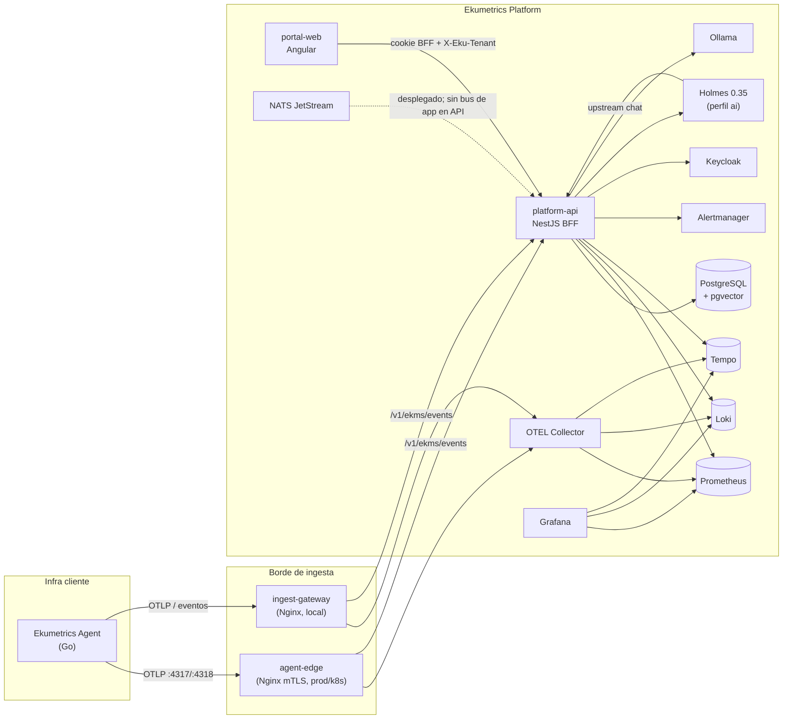

# Arquitectura actual de Ekumetrics (estado observado)

Documento de auditoría. Solo hechos presentes en el repositorio a la fecha de redacción. **No propone implementación.**

**Nomenclatura**

| Término | Significado en este documento |
|---|---|
| **Ekumetrics Agent** | Binario recolector en infra del cliente (`ekumetrics-agent/`) |
| **AIOps Agent** | Investigador lógico *dentro* de la plataforma (`RcaAgent`, `MetricsAgent`, `LogsAgent`, `KubernetesAgent`, `TopologyAgent`, `SynthesisAgent`; orquestados por `AgentOrchestratorService`) |
| **HolmesGPT / Holmes** | Motor/backend opcional usado por EkuAssistant; **no es la arquitectura AIOps** |

Espacio de trabajo: dos repos hermanos bajo `ekumetrics/`:

- `ekumetrics-agent/` — recolector Go
- `ekumetrics-platform/` — portal Angular, API NestJS, contratos, infraestructura

---

## 1. Diagrama de flujo actual



Flujo de correlación / investigación **ya existente** (no es multi-agent AIOps):

```mermaid
flowchart TD
  EA2[Ekumetrics Agent] -->|eventos vecinos LLDP/CDP| ING[IngestService]
  ING --> GS[GraphService\nGraphNode / GraphEdge]
  AM2[Alertmanager] --> COR[CorrelationService]
  GS --> COR
  COR -->|cluster ventana 5m + hops| INC[(Incident)]
  INC --> UI1[/incidentes/]
  GS --> UI2[/investigacion/ cytoscape]
  COR --> UI2
  ASK[EkuAssistant /asistente] --> AIS[AiService + RetrievalService]
  AIS --> HOL[Holmes opcional]
  AIS --> PROM2[Prometheus/Loki/Tempo/PG]
```

---

## 2. Tabla de componentes

| Componente | Path / imagen | Responsabilidad observada |
|---|---|---|
| portal-web | `ekumetrics-platform/apps/portal-web/` | UI Angular 22 standalone: dashboards, alertas, incidentes, investigación, admin, kiosk, EkuAssistant |
| platform-api | `ekumetrics-platform/apps/platform-api/` | NestJS 11 BFF: auth, ingesta, telemetría query, AI, alertas, correlación, tenants |
| shared-contracts | `ekumetrics-platform/packages/shared-contracts/openapi/platform-v0.yaml` | Contrato OpenAPI de plataforma / eventos |
| Ekumetrics Agent | `ekumetrics-agent/` | Recolector Go 1.27: métricas, logs, SNMP, discovery, NetFlow, SAP, export OTLP + eventos EKMS |
| PostgreSQL + pgvector | `pgvector/pgvector:0.8.6-pg18-bookworm` | Persistencia de producto, sesiones, grafo, RAG embeddings |
| NATS JetStream | `nats:2.14.5-alpine` + `infrastructure/*/nats-server.conf` | Desplegado con JetStream persistente; **no hay cliente NATS en platform-api** |
| Prometheus | `prom/prometheus:v3.14.0` | Métricas (agente + plataforma) |
| Loki | `grafana/loki:3.7.6` | Logs |
| Tempo | `grafana/tempo:3.0.2` | Trazas |
| OTEL Collector | `otel/opentelemetry-collector-contrib:0.159.0` | Ingesta OTLP → Prometheus / Loki / Tempo |
| Alertmanager | `prom/alertmanager:v0.34.0` | Alertas; API gestiona overview, silencios, canales |
| Grafana | `grafana/grafana:13.2.0` | Dashboards provisionados |
| Alloy | `grafana/alloy:v1.19.2` | Recolección de logs de contenedores → Loki |
| Keycloak | `quay.io/keycloak/keycloak:26.7.2` | IdP OIDC (roles operator/admin/viewer) |
| ingest-gateway | Nginx 1.30 (Compose local) | Proxy HTTP local OTLP + eventos (sin mTLS) |
| agent-edge | Nginx (Compose production + k8s) | Terminación mTLS del agente |
| Holmes | `robustadev/holmes:0.35.0` (perfil `ai`) | Investigador opcional detrás de EkuAssistant |
| Ollama | `ollama/ollama:0.33.0` | LLM local + embeddings |
| node-exporter / kube-state-metrics | k8s (+ node-exporter en Compose) | Métricas de host / objetos K8s |

**Redis:** no hay servicio Redis de plataforma. Redis aparece solo como **tipo de target monitoreado** por Ekumetrics Agent (`type: redis`) y series Prometheus (`redis_*`) en dashboards.

---

## 3. Frontend (portal-web)

### Stack

| Pieza | Versión / nota |
|---|---|
| Angular | `^22.1.3` (`apps/portal-web/package.json`) |
| Angular Material / CDK | `^22.1.4` |
| ECharts | `^6.1.0` |
| Cytoscape | `^3.34.2` (grafo de investigación) |
| marked / DOMPurify | markdown del asistente |
| Vitest / Playwright | tests unitarios / e2e |
| Node / npm | `24.x` / `12.x` |

Standalone components; formularios reactive (`FormBuilder`). Sin NgModules de dominio.

### Estructura

```
apps/portal-web/src/app/
  app.routes.ts          # rutas
  core/                  # auth, tenant, kiosk, guards, interceptors
  layout/                # shell + nav.ts
  pages/                 # páginas por dominio
  shared/eku/            # cy-graph, chart, page-header, empty/error states
  validators/
```

### Rutas principales (`app.routes.ts`)

| Ruta | Página | Roles |
|---|---|---|
| `/login`, `/enrolar-mfa` | Login / MFA | público / autenticado |
| `/hosts`, `/red`, `/agentes`, `/bases-de-datos`, `/colas`, `/icewarp`, `/sap` | `HomePage` (dashboards por matcher) | autenticado; módulos opcionales de tenant |
| `/asistente` (`/holmes` → redirect) | `HolmesPage` (EkuAssistant) | autenticado |
| `/dashboards`, `/dashboards/:id`, `.../ver` | Boards | viewer+; edición operator/admin |
| `/plataforma` | `PlataformaPage` (E-Platform: health, logs, traces) | operator/admin |
| `/alertas`, `/alertas/canales` | Alertas / canales | operator/admin |
| `/incidentes` | `IncidentsPage` | operator/admin |
| `/investigacion` (`/correlacion` → redirect) | `InvestigacionPage` | operator/admin |
| `/administracion/*` | Tenants, usuarios, sitios, identidad, umbrales, IA, descarga agente | operator y/o admin |
| `/kiosk/*` | Activación y vistas kiosk | kiosk guard |

Navegación: `layout/nav.ts`. Interceptor: cookie BFF + CSRF; operadores envían `X-Eku-Tenant` (`core/auth.interceptor.ts`).

### Capacidades UI ya presentes (AIOps-related)

- **Investigación**: grafo Cytoscape + incidentes correlacionados (`pages/investigacion/`).
- **Incidentes**: listado y acción de correlacionar (`pages/incidents/`).
- **Correlación legacy**: `pages/correlacion/` aún en árbol (redirect de ruta a investigación).
- **EkuAssistant**: chat Holmes-backed (`pages/holmes/`).
- **E-Platform**: overview de cluster/servicios, logs y traces de plataforma (`pages/plataforma/`).

---

## 4. Backend (platform-api)

### Stack

| Pieza | Versión |
|---|---|
| NestJS | `^11.2.3` |
| Prisma | `^7.10.0` (+ `@prisma/adapter-pg`) |
| jose | `^6.2.10` (JWT / JWKS) |
| OpenTelemetry SDK | `^0.221.0` + auto-instrumentations |
| Node / npm | `24.x` / `12.x` |

### Módulos Nest (`app.module.ts`)

| Módulo | Path | Responsabilidad |
|---|---|---|
| PrismaModule | `prisma/` | Cliente Prisma |
| AuthModule | `auth/` | BFF OIDC, sesiones, MFA, roles, audit |
| HealthModule | `health/` | `/health`, `/health/ready` |
| IngestModule | `ingest/` | `POST /v1/ekms/events` |
| ObservabilityModule | `observability/` | métricas HTTP, retención de eventos, tracing |
| DashboardModule | `dashboard/` | agregados PromQL para vistas |
| BoardsModule | `boards/` | dashboards custom |
| TenantsModule | `tenants/` | tenants, sitios, agentes, YAML de agente, admin users |
| AiModule | `ai/` | EkuAssistant, retrieval, knowledge/RAG, settings |
| AlertmanagerModule | `alertmanager/` | overview, silencios, canales |
| IncidentsModule | `aiops/` | correlación, grafo, incidentes |

También: `platform/platform.controller.ts` (E-Platform), `kiosk/`.

### Controladores / API surface (resumen)

| Prefijo | Archivo | Endpoints clave |
|---|---|---|
| `v1/auth` | `auth.controller.ts` | login-options, broker, login, callback, session, MFA, logout |
| `v1/identity` | `identity.controller.ts` | identidad del tenant |
| `v1/ekms` | `ingest.controller.ts` | `POST events` |
| `v1/dashboard` | `dashboard.controller.ts` | payload de dashboards |
| `v1/boards` | `boards.controller.ts` | CRUD / view |
| `v1/tenants` | `tenants.controller.ts` | tenants, sites, agents |
| `v1/admin` | `admin.controller.ts` | usuarios |
| `v1/alerts` | `alertmanager.controller.ts` | alertas, channels, silences |
| `v1/incidents`, `v1/graph` | `aiops/incidents.controller.ts` | list/get, correlate, graph snapshot/example/impact |
| `v1/ai` | `ai.controller.ts` | ask, conversations, knowledge, settings, upstream |
| `v1/platform` | `platform.controller.ts` | overview, logs, traces, thresholds |
| `v1/kiosk` | `kiosk.controller.ts` | session, devices |
| `health`, `metrics` | health / observability | probes y métricas Prometheus de la API |

---

## 5. Ekumetrics Agent

### Lenguaje y entrypoints

- Go `1.27.0` (`ekumetrics-agent/go.mod`)
- Módulo: `gradotech.dev/ekumetrics-agent`
- Binarios: `cmd/agent`, `cmd/agentw1`, `cmd/license`
- Config canónica: `config/agent.yaml`

### Módulos (`pkg/modules/`)

| Módulo | Función |
|---|---|
| `collector` / `collectorb4` | Host metrics, SNMP, traps, apps (postgres/mysql/redis/mongo/…) vía otelcol embebido |
| `discovery` / `discoveryb1` | Inventario pasivo (ARP, LLDP, CDP, ENTITY) |
| `fluentbit` | Generación/proceso Fluent Bit para logs |
| `netflow` / `netflowb3` | NetFlow v5 |
| `probes` / `probesw1` | ICMP/TCP probes |
| `sap` | Canal SAP (sensor) |
| `zeek` | Zeek (si embebido) |
| `expand` | Expansión de config |

Otros paquetes: `pkg/ekms` (envelope, buffer store-and-forward, mTLS), `pkg/ingest` (pcap/live), `pkg/work` (eventos JSONL), `pkg/license`, `pkg/agent/config`.

### YAML y exportación

- Identidad: `agent.tenantId`, `agent.site`, `agent.agentId`, `agent.mode` (`site` \| `central` \| `sensor` \| `endpoint`)
- `export.otlp.endpoint` → OTLP + derivado de endpoint de eventos `/v1/ekms/events`
- Buffer local con reintentos
- Bloques: `modules.*`, `snmp`, datastores/colas, IceWarp, SAP
- La plataforma genera YAML de despliegue: `tenants/agent-yaml.ts`

Prometheus client_golang `v1.24.1` en el agente.

---

## 6. ORM / base de datos (Prisma)

Schema: `ekumetrics-platform/apps/platform-api/prisma/schema.prisma`  
Datasource: PostgreSQL. Cliente generado en `apps/platform-api/generated`.

### Modelos relevantes

| Modelo | Rol |
|---|---|
| `Tenant` | Multi-tenant (`slug` único, `modules[]`) |
| `Site` | Sitios por tenant (`@@unique([tenantId, slug])`) |
| `Agent` | Registro de Ekumetrics Agent (`agentId`, `siteId`, `mode`, `lastSeenAt`) |
| `Asset` | Inventario de activos |
| `AgentEvent` | Eventos EKMS (fingerprint único) |
| `Incident` | Incidentes correlacionados (`clusterKey`, `causeKey`, `confidence`, `members` JSON, status enum) |
| `GraphNode` / `GraphEdge` | Topología (vecinos LLDP/ejemplo) |
| `Policy` | Políticas JSON |
| `User` | Usuarios de producto (rol string) |
| `AlertChannel` | Canales de notificación (config cifrada) |
| `WebSession` | Sesiones BFF (tokens cifrados) |
| `KioskDevice` | Pantallas kiosk |
| `CustomDashboard` | Boards |
| `AiConversation` / `AiInquiry` / `AiSettings` | EkuAssistant |
| `AiKnowledgeDocument` / `AiKnowledgeChunk` | RAG (`vector(1024)`, `tsvector`) |
| `TenantIdentity` | MFA / Entra / AD por tenant |
| `PlatformThresholds` | Umbrales |
| `AuditLog` | Auditoría |

`IncidentStatus`: `open` \| `acknowledged` \| `resolved` \| `closed`.

---

## 7. PostgreSQL

- Imagen Compose/K8s: **pgvector 0.8.6 sobre PostgreSQL 18**
- DB/usuario: `ekumetrics`
- Usos: dominio de producto, sesiones web, grafo, incidentes, RAG (HNSW + RRF documentado en `docs/architecture.md`)
- Migraciones Prisma bajo `apps/platform-api/prisma/`

---

## 8. Redis

| Pregunta | Hecho |
|---|---|
| ¿Redis como cache/bus de plataforma? | **No** |
| ¿Dependencia npm redis/ioredis en API? | Solo instrumentación transitiva OTEL; no hay cliente de aplicación |
| ¿Dónde aparece Redis? | Target del **Ekumetrics Agent** y métricas `redis_*` en dashboard |

---

## 9. NATS

| Pregunta | Hecho |
|---|---|
| ¿Existe en Compose/K8s? | **Sí** — servicio `nats` |
| ¿JetStream? | **Sí** — `jetstream { store_dir: /data; ... }` en `infrastructure/docker/nats/nats-server.conf` y `infrastructure/k8s/nats-server.conf` |
| ¿Bus de eventos de application en platform-api? | **No observado** — sin publish/subscribe en `src/` |
| Uso observado | Despliegue + métricas de cola monitoreadas vía agente (`nats_varz_*` en dashboard/retrieval) |

No hay otro message bus (Kafka/Rabbit) en la plataforma; Kafka/Rabbit sí son targets opcionales del recolector.

---

## 10. OpenTelemetry

| Capa | Detalle |
|---|---|
| Ingesta | Collector Contrib `0.159.0`: receivers OTLP gRPC/HTTP 4317/4318 |
| Procesado | Transforms que promocionan `tenant.id`, `host.site`, `agent.id`, `service.*` |
| Export | Prometheus scrape endpoint `:8889`, OTLP→Loki, OTLP→Tempo |
| API | `observability/tracing.ts` — NodeSDK si `OTEL_EXPORTER_OTLP_ENDPOINT` |
| Agente | Export OTLP + receive OTLP opcional para apps locales |
| Borde | Local: `ingest-gateway`; Prod/K8s: `agent-edge` mTLS |

---

## 11. Metrics / logs / traces

| Señal | Store | Notas |
|---|---|---|
| Métricas | Prometheus v3.14 + reglas SLO/capacidad | Scrape OTEL, node-exporter, kube-state-metrics (k8s) |
| Logs | Loki 3.7.6 | Alloy + Fluent Bit del agente vía OTEL |
| Trazas | Tempo 3.0.2 | TraceQL; enlaces Grafana a logs por `trace_id` |
| Visualización | Grafana 13.2 + portal (ECharts / embeds) | Dashboards: agent, host, icewarp, logs, slo |

La API consulta estas fuentes de forma tipada (`dashboard/telemetry.client.ts`, `ai/retrieval.service.ts`, `platform/`).

---

## 12. Autenticación

| Mecanismo | Detalle |
|---|---|
| IdP | Keycloak realm `ekumetrics`, client `portal-web` |
| Flujo humano | BFF: PKCE / broker → callback → cookie `HttpOnly` opaca; tokens OIDC cifrados en `WebSession` |
| JWT | Validación RS256 (Keycloak) / HS256 (kiosk); audiencia e issuer exigidos |
| MFA | TOTP vía Keycloak + enrollment en portal |
| Identidad federada | `TenantIdentity`: Entra ID / AD opcionales |
| Kiosk | Credencial de dispositivo → Bearer; `AuthRole` incluye `kiosk` |
| CSRF | Header `X-CSRF-Token` en métodos no seguros |
| Agente | `INGEST_SHARED_KEY` + (prod) assertion de edge + DN certificado `O=tenant,OU=site,CN=agent` |

Los access tokens de Keycloak **no** se exponen al navegador (BFF).

---

## 13. RBAC

Roles tipados: `operator` \| `admin` \| `viewer` \| `kiosk` (`auth/auth.types.ts`).

| Rol | Alcance observado |
|---|---|
| `operator` | Gradotech: puede actuar sobre cualquier tenant (`actingTenant` + `X-Eku-Tenant` / `?as=`) |
| `admin` | Admin del tenant (usuarios, sitios, alertas, investigación, etc.) |
| `viewer` | Lectura (dashboards / asistente; sin alertas/admin) |
| `kiosk` | Solo vistas kiosk |

Decorador `@Roles(...)` en controladores; `roleGuard` en portal.

---

## 14. Multi-tenancy

| Concepto | Implementación |
|---|---|
| Tenant | `Tenant.slug`; claim/sesión + selector UI |
| Header | `X-Eku-Tenant` (operadores) — interceptor portal |
| Query | `?as=<slug>` en varios endpoints |
| Sites | `Site` por tenant; agentes ligados a `siteId` (slug) |
| Módulos opcionales | `icewarp`, `sap`, `databases`, `queues`, `network` en `Tenant.modules` |
| Aislamiento datos | Queries Prisma con `tenantId`; retrieval AI valida tenant antes de PromQL/LogQL/TraceQL |

---

## 15. Alertas, eventos, incidentes, grafo

### Ya implementado

| Capacidad | Dónde |
|---|---|
| Eventos EKMS | `ingest/` → `AgentEvent` + assets + heartbeat |
| Topología desde vecinos | Señales de discovery → `GraphService.upsertNeighbor` (source default `lldp`) |
| Grafo ejemplo | `POST /v1/graph/example` + `graph-example.ts` |
| Impacto / walk | `graph-walk.ts`, `GET /v1/graph/impact` |
| Correlación de alertas | `CorrelationService`: ventana 5 min, hops=4, cluster por sitio + path en grafo → `Incident` |
| Listado incidentes | `GET /v1/incidents`, UI `/incidentes` |
| UI investigación | `/investigacion` (Cytoscape + causa/impacto) y panel AIOps en `/incidentes` |
| Alertmanager | Overview, silences, canales por tenant |
| EkuAssistant | Retrieval cerrado + Holmes/LLM; **no orquesta AIOps Agents** |

### No encontrado en código

- Integración ITSM (ServiceNow/Jira/tickets outbound)
- Remediation agent / runbooks ejecutables (`RemediationAgent` / `SecurityAgent` son interfaz reservada, no se ejecutan)

Wave 3 (2026-09-05): `AgentOrchestratorService` + AIOps Agents + `AgentFinding` persistido. Detalle: `docs/aiops/wave-3-investigation.md`.

HolmesGPT es herramienta de EkuAssistant (`HOLMES_URL`, perfil Compose `ai`, toolsets de cluster deshabilitados en `holmes/config.yaml`).

---

## 16. Kubernetes / Kind / Docker

### Docker Compose (local)

- Path: `ekumetrics-platform/infrastructure/docker/docker-compose.yml`
- Scripts raíz: `npm run platform:up`, `platform:services`, `platform:ai`, …
- Servicios core: postgres, nats, prometheus, loki, tempo, alertmanager, grafana, otel-collector, alloy, keycloak, node-exporter, platform-api, ingest-gateway, portal-web, ollama (+ pull)
- Holmes: **profile `ai`**
- Override prod: `docker-compose.production.yml` (secretos montados, **agent-edge** mTLS, endurecimiento)

### Kubernetes (Kustomize)

- Base: `infrastructure/k8s/kustomization.yaml` (namespace `ekumetrics`)
- Recursos: postgres, keycloak(+db), nats, platform-api, portal-web, prometheus, loki, tempo, alertmanager, grafana, otel, ingest-gateway, holmes, ollama, alloy, exporters, **agent-edge**, RBAC, NetworkPolicy, Ingress
- **No hay charts Helm** en el árbol; es Kustomize puro

### Kind

- Overlay: `infrastructure/kind/kustomization.yaml` → recursos `../k8s`
- Parches: ingress `*.lvh.me`, keycloak hostname, ollama scale, PVC `storageClassName: standard`
- Imágenes tag `kind` para platform-api y portal-web

### Kind vs Docker (hechos)

| Aspecto | Docker Compose | Kind / K8s |
|---|---|---|
| Orquestación | Compose files | Kustomize |
| Borde agente | Local: ingest-gateway; Prod override: agent-edge | agent-edge + NetworkPolicy |
| DNS UI | `localhost` + puertos | Ingress `ekumetrics.lvh.me` (kind) / `*.gd.lan` (base) |
| kube-state-metrics | No en Compose | Sí |
| Holmes | Profile opcional | Manifiesto incluido |

---

## 17. Integraciones externas

| Integración | Estado observado |
|---|---|
| HolmesGPT | Opcional; `robustadev/holmes:0.35.0`; upstream apunta a `platform-api /v1/ai/upstream` |
| Ollama | Local default (`qwen3.5:4b`, embedding `qwen3-embedding:0.6b`) |
| LLM cloud | Catálogo: OpenAI, Anthropic, Kimi, Grok, DeepSeek, OpenAI-compat (`ai.catalog.ts`) |
| Entra ID / AD | Config por tenant (`TenantIdentity`) |
| ITSM | **No implementado** |
| CMDB externa | No; inventario local `Asset` + grafo |

---

## 18. Versiones (extracto)

| Componente | Versión |
|---|---|
| ekumetrics-platform | `1.0.0` |
| Node / npm | 24.x / 12.x |
| NestJS | 11.2.x |
| Angular | 22.1.x |
| Prisma | 7.10.x |
| Go (agent) | 1.27.0 |
| PostgreSQL | 18 + pgvector 0.8.6 |
| NATS | 2.14.5 |
| Prometheus | 3.14.0 |
| Loki | 3.7.6 |
| Tempo | 3.0.2 |
| Grafana | 13.2.0 |
| OTEL Collector | 0.159.0 |
| Keycloak | 26.7.2 |
| Alertmanager | 0.34.0 |
| Alloy | 1.19.2 |
| Ollama | 0.33.0 |
| Holmes | 0.35.0 |
| Nginx (gateways) | 1.30.4-alpine |

---

## 19. Qué hay hoy de “AIOps” (síntesis factual)

1. **Ingesta + inventario + topología LLDP** → PostgreSQL (`AgentEvent`, `Asset`, `GraphNode`/`GraphEdge`).
2. **Correlación determinista** Alertmanager ↔ grafo → `Incident` (causa probable, confianza, miembros).
3. **UI** de alertas, incidentes e investigación con grafo.
4. **EkuAssistant** (retrieval tipado + LLM/Holmes) para preguntas operativas — paralelo, no orquestador multi-agente.
5. **Investigación AIOps Wave 3**: `AgentOrchestratorService` dispara especialistas en paralelo y síntesis; política default `MANUAL` / `AI_DISABLED`. Holmes no orquesta.
6. **Ausente**: ITSM, remediación aprobada, auto-correlación.

Documentación de producto relacionada (no sustituye este inventario):  
`ekumetrics-platform/docs/architecture.md`, `tenants-sitios-agentes.md`, `ekumetrics-agent/docs/ROL.md`.

---

## Archivos clave

```
docs/aiops/current-architecture.md          # este documento
docs/aiops/wave-3-investigation.md          # orquestador AIOps Agents

ekumetrics-platform/package.json
ekumetrics-platform/docs/architecture.md
ekumetrics-platform/packages/shared-contracts/openapi/platform-v0.yaml

ekumetrics-platform/apps/portal-web/package.json
ekumetrics-platform/apps/portal-web/src/app/app.routes.ts
ekumetrics-platform/apps/portal-web/src/app/layout/nav.ts
ekumetrics-platform/apps/portal-web/src/app/core/auth.interceptor.ts
ekumetrics-platform/apps/portal-web/src/app/pages/investigacion/
ekumetrics-platform/apps/portal-web/src/app/pages/incidents/
ekumetrics-platform/apps/portal-web/src/app/pages/holmes/
ekumetrics-platform/apps/portal-web/src/app/pages/plataforma/

ekumetrics-platform/apps/platform-api/package.json
ekumetrics-platform/apps/platform-api/prisma/schema.prisma
ekumetrics-platform/apps/platform-api/src/app.module.ts
ekumetrics-platform/apps/platform-api/src/aiops/investigation/investigation.module.ts
ekumetrics-platform/apps/platform-api/src/aiops/correlation.service.ts
ekumetrics-platform/apps/platform-api/src/aiops/graph.service.ts
ekumetrics-platform/apps/platform-api/src/aiops/graph-walk.ts
ekumetrics-platform/apps/platform-api/src/aiops/incidents.controller.ts
ekumetrics-platform/apps/platform-api/src/ingest/ingest.service.ts
ekumetrics-platform/apps/platform-api/src/auth/auth.service.ts
ekumetrics-platform/apps/platform-api/src/auth/auth.types.ts
ekumetrics-platform/apps/platform-api/src/ai/ai.service.ts
ekumetrics-platform/apps/platform-api/src/ai/retrieval.service.ts
ekumetrics-platform/apps/platform-api/src/ai/ai.catalog.ts
ekumetrics-platform/apps/platform-api/src/alertmanager/alertmanager.service.ts
ekumetrics-platform/apps/platform-api/src/observability/tracing.ts

ekumetrics-platform/infrastructure/docker/docker-compose.yml
ekumetrics-platform/infrastructure/docker/docker-compose.production.yml
ekumetrics-platform/infrastructure/docker/nats/nats-server.conf
ekumetrics-platform/infrastructure/docker/otel/config.yaml
ekumetrics-platform/infrastructure/docker/holmes/config.yaml
ekumetrics-platform/infrastructure/k8s/kustomization.yaml
ekumetrics-platform/infrastructure/kind/kustomization.yaml

ekumetrics-agent/go.mod
ekumetrics-agent/config/agent.yaml
ekumetrics-agent/pkg/agent/config/config.go
ekumetrics-agent/pkg/modules/
ekumetrics-agent/pkg/ekms/
ekumetrics-agent/docs/ROL.md
ekumetrics-agent/docs/USO.md
```
